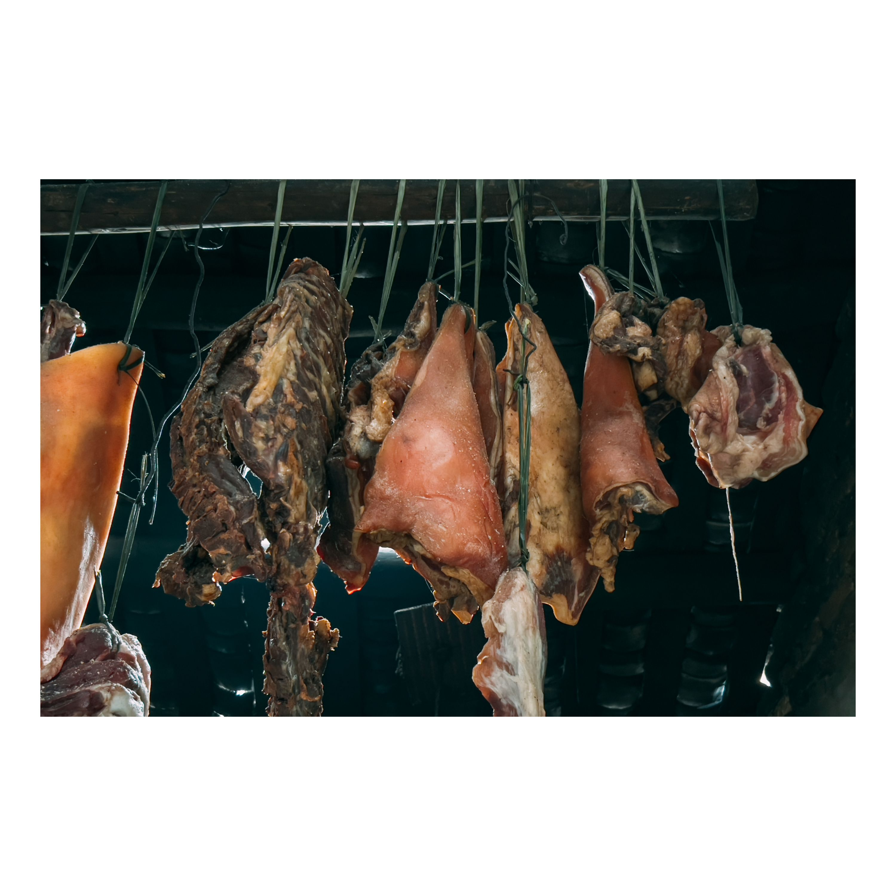
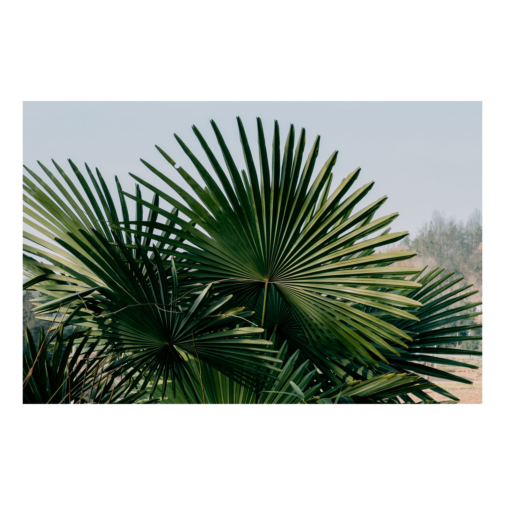
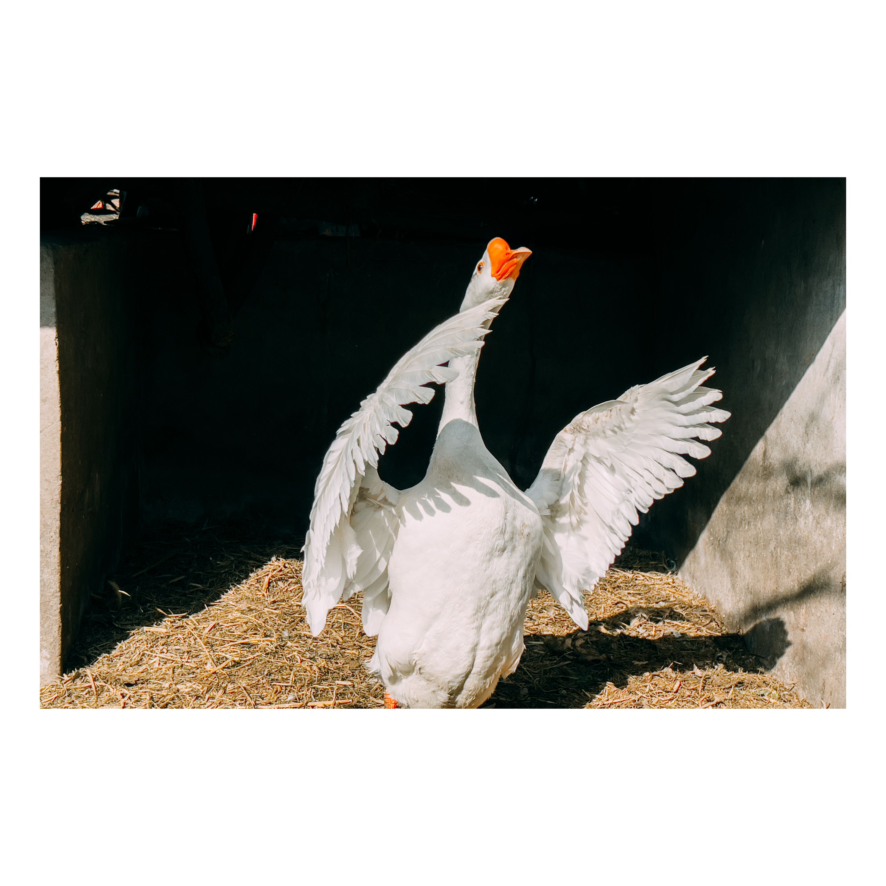
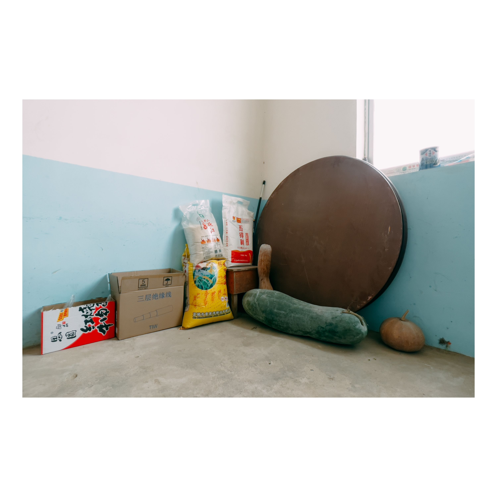
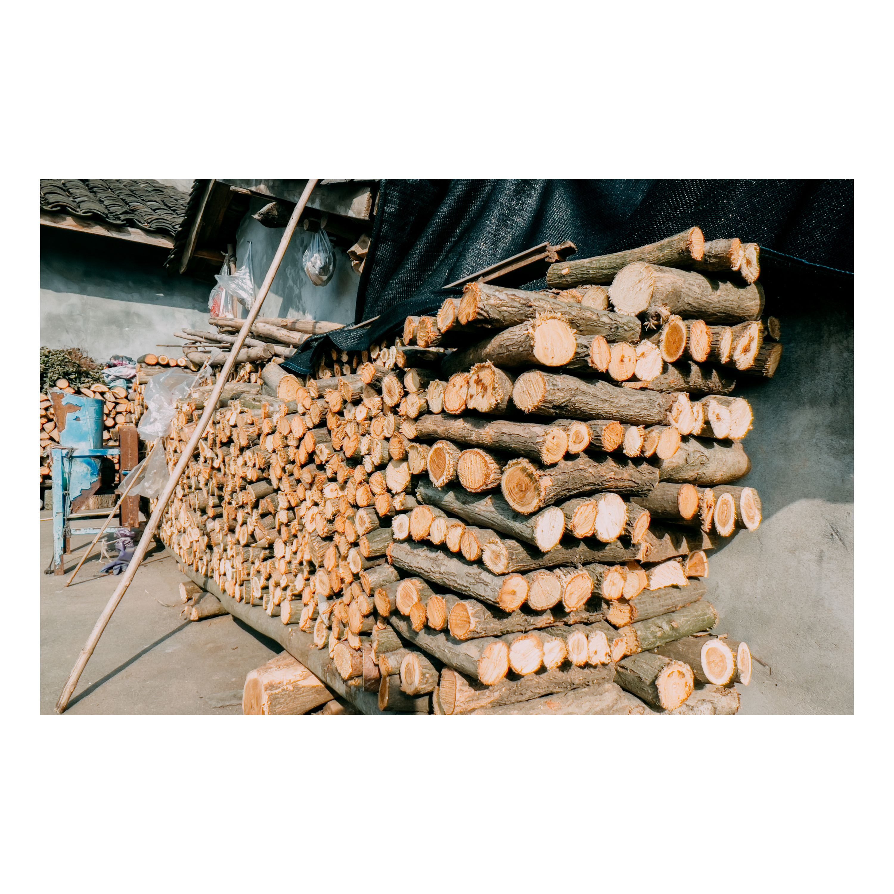
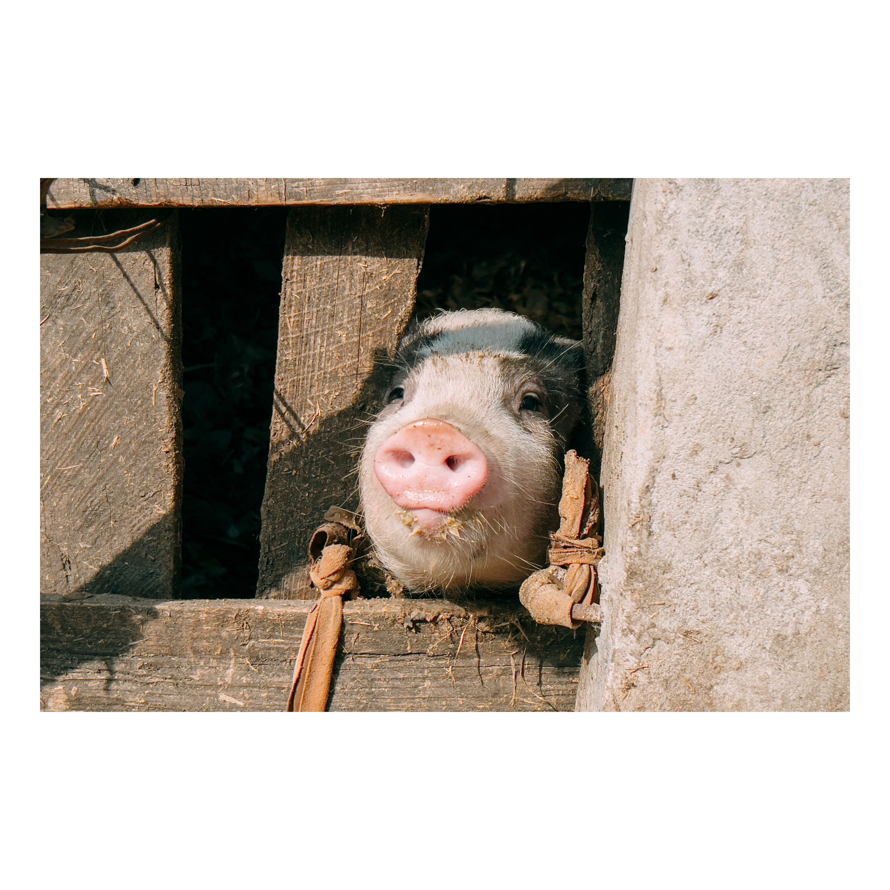

# 没有大城市的繁华，却有人间最纯净的朴素 {: .article-title}

- {: .fancybox-gallery }
- {: .fancybox-gallery }
- {: .fancybox-gallery }
- {: .fancybox-gallery }
- {: .fancybox-gallery }
- {: .fancybox-gallery }

