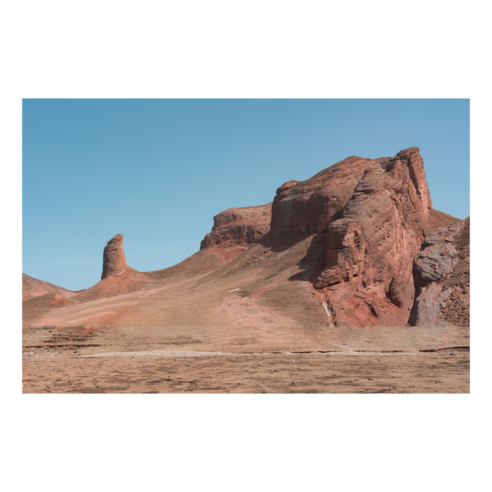
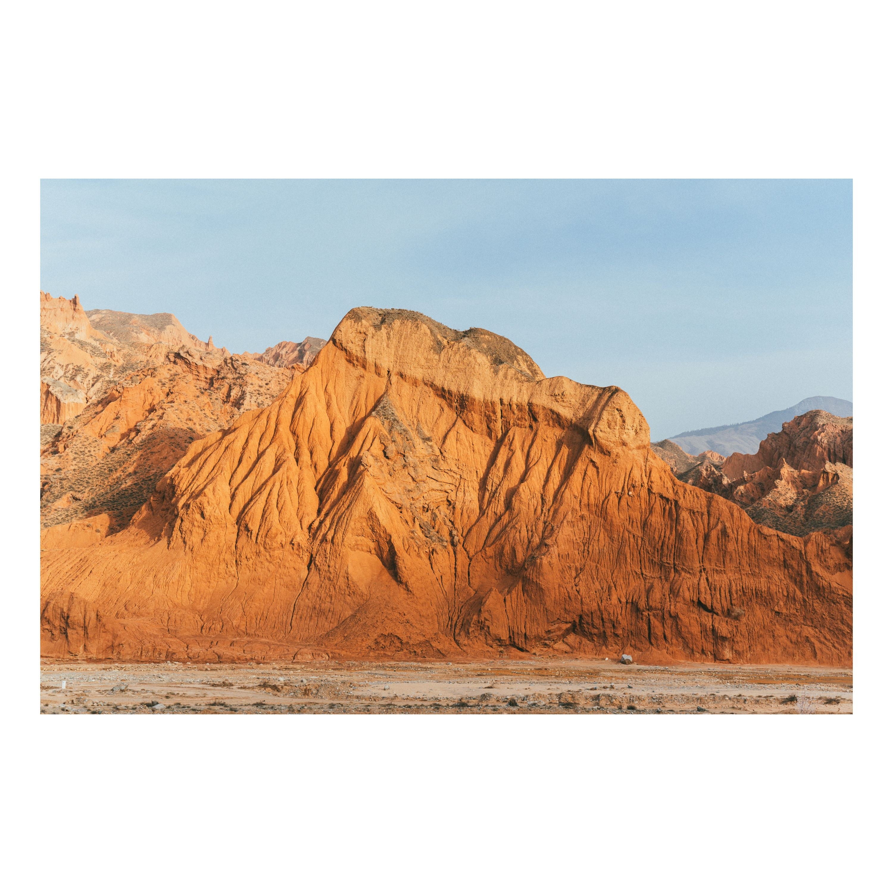
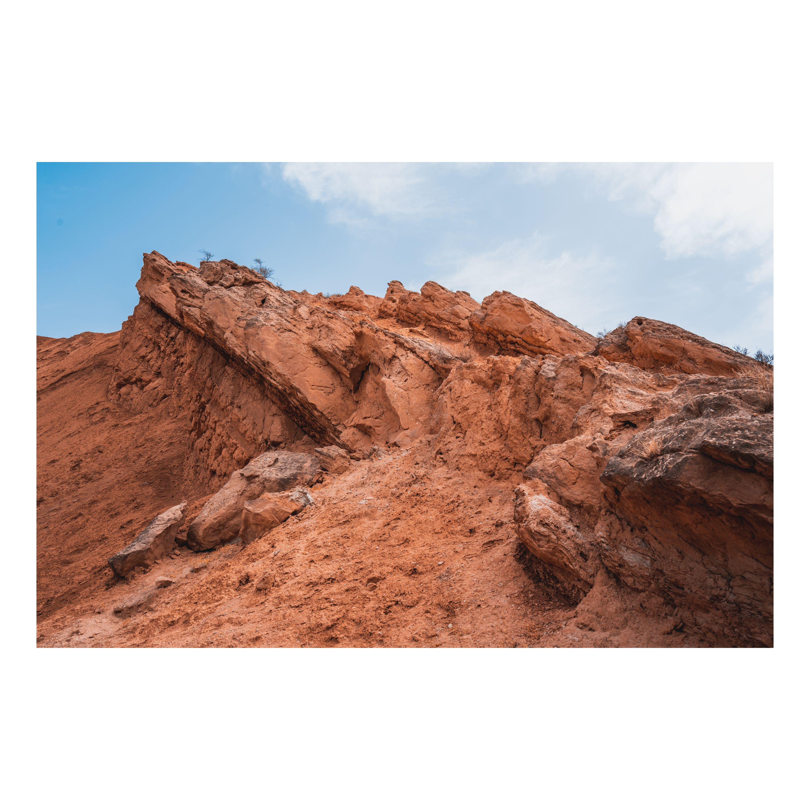
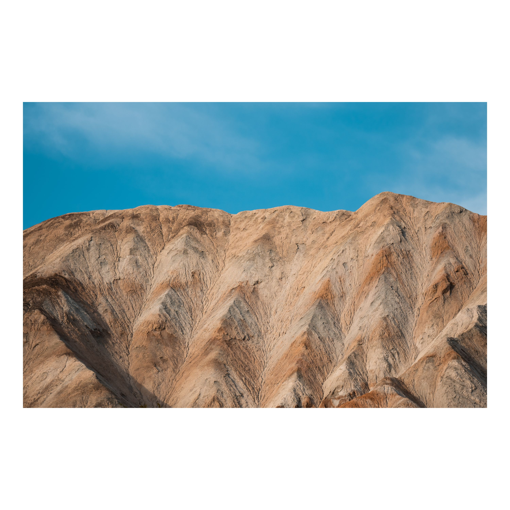
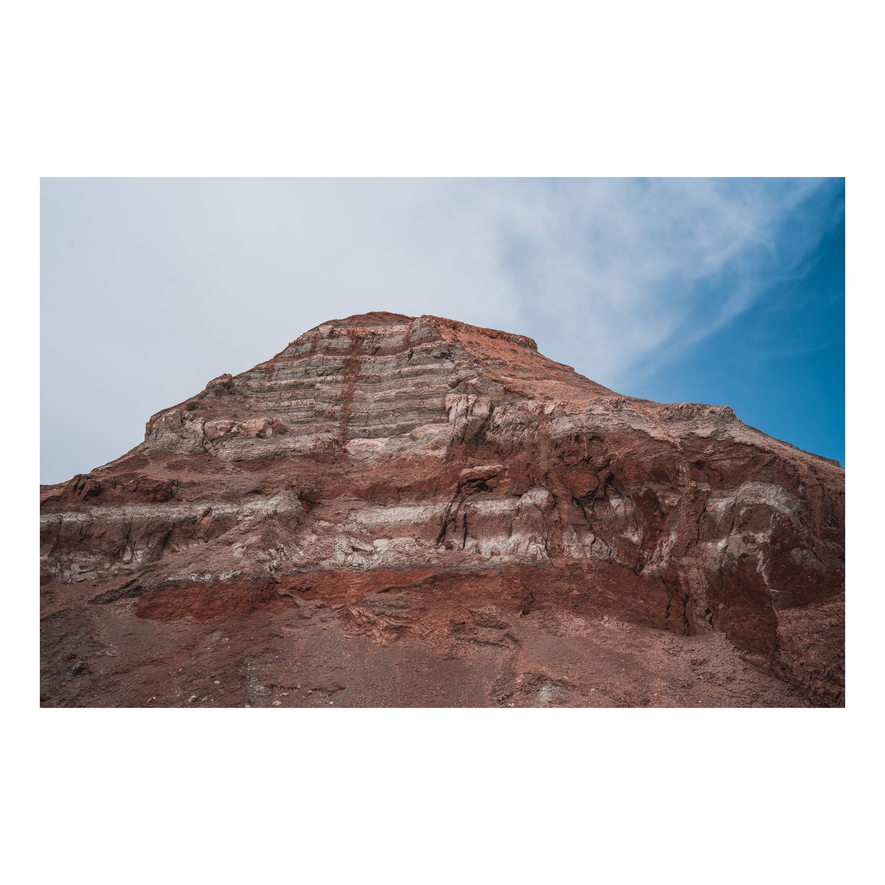
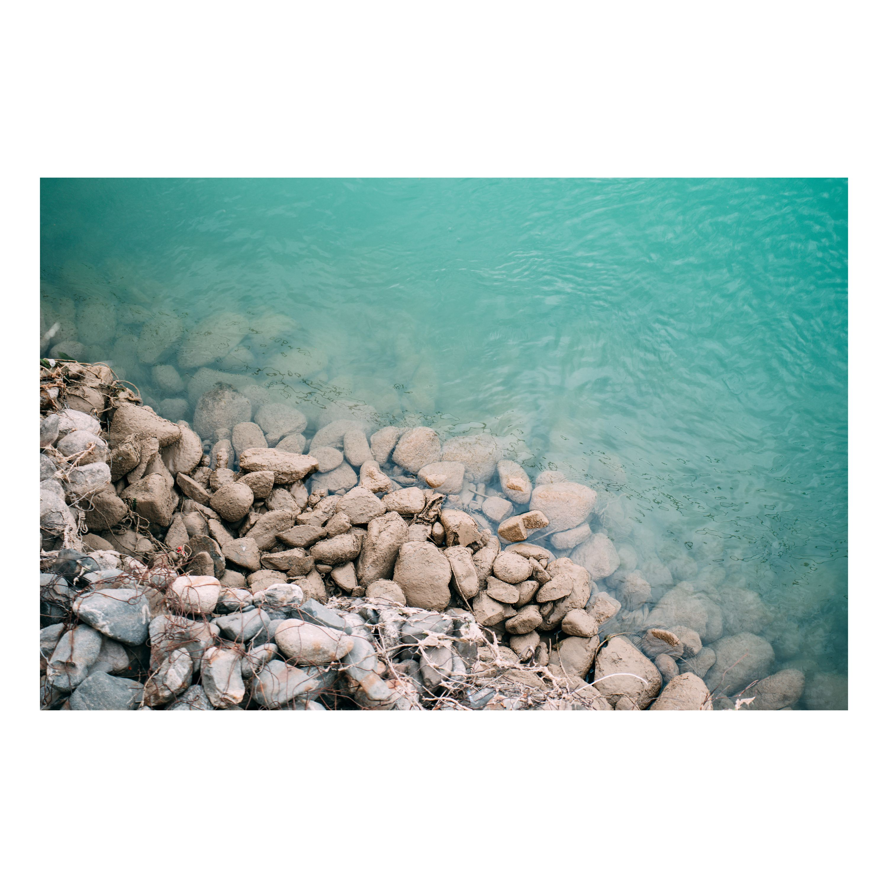
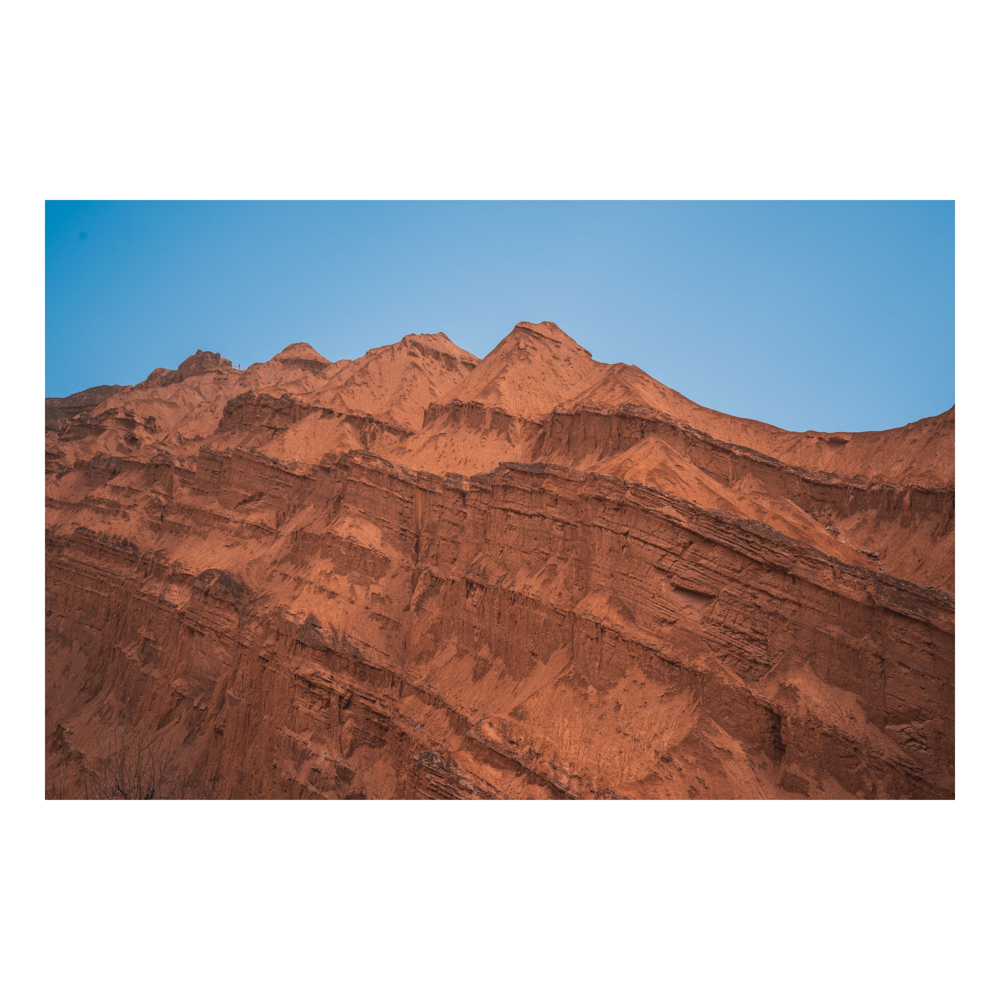
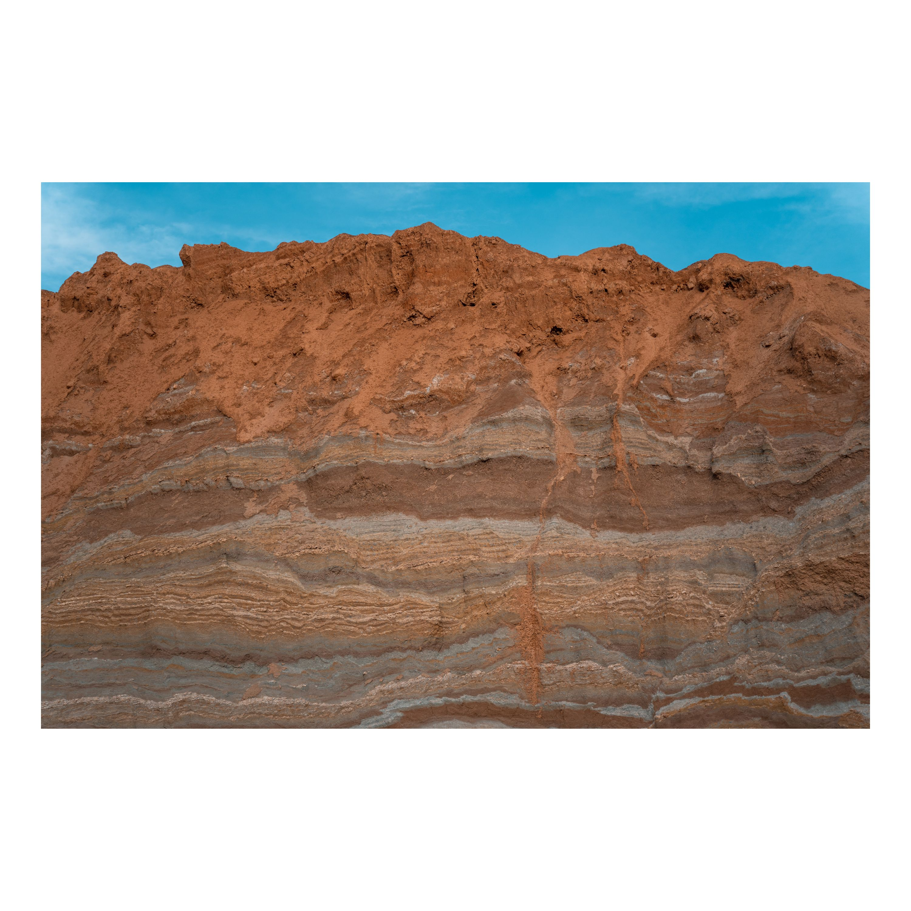
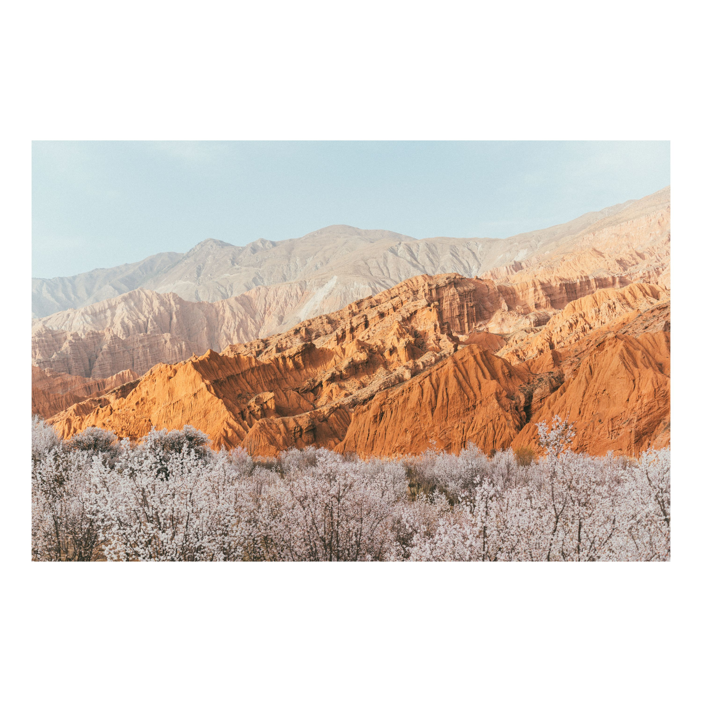

# 青海贵德｜奇特的丹霞地貌和清澈见底的黄河 {: .article-title}

- {: .fancybox }
- {: .fancybox }
- {: .fancybox }
- {: .fancybox }
- {: .fancybox }
- {: .fancybox }
- {: .fancybox }
- {: .fancybox }
- {: .fancybox }

