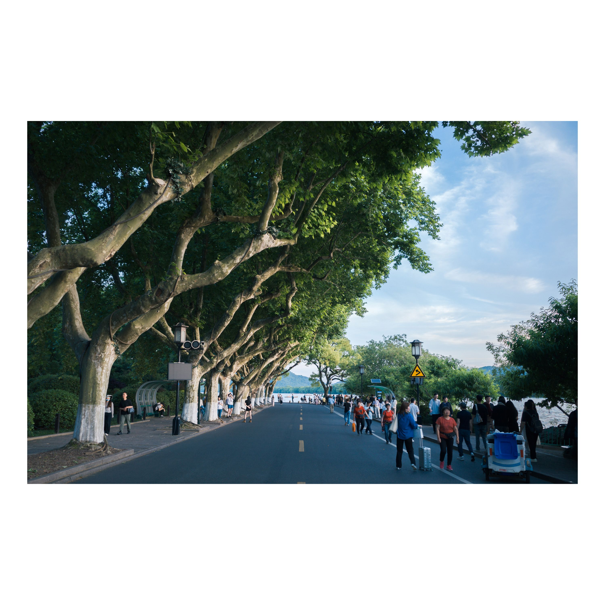
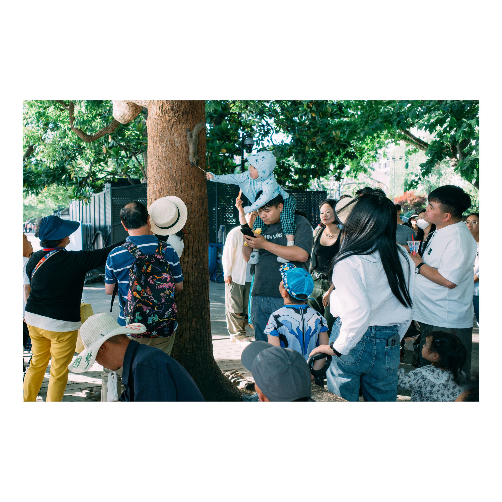

# GR3｜麻木不仁的日子里，记录就是反抗 {: .article-title}

- {: .fancybox }
- {: .fancybox }
- {: .fancybox }
- {: .fancybox }
- {: .fancybox }
- {: .fancybox }
- {: .fancybox }
- {: .fancybox }
- {: .fancybox }
- {: .fancybox }
- {: .fancybox }
- {: .fancybox }
- {: .fancybox }
- {: .fancybox }
- {: .fancybox }
- {: .fancybox }

